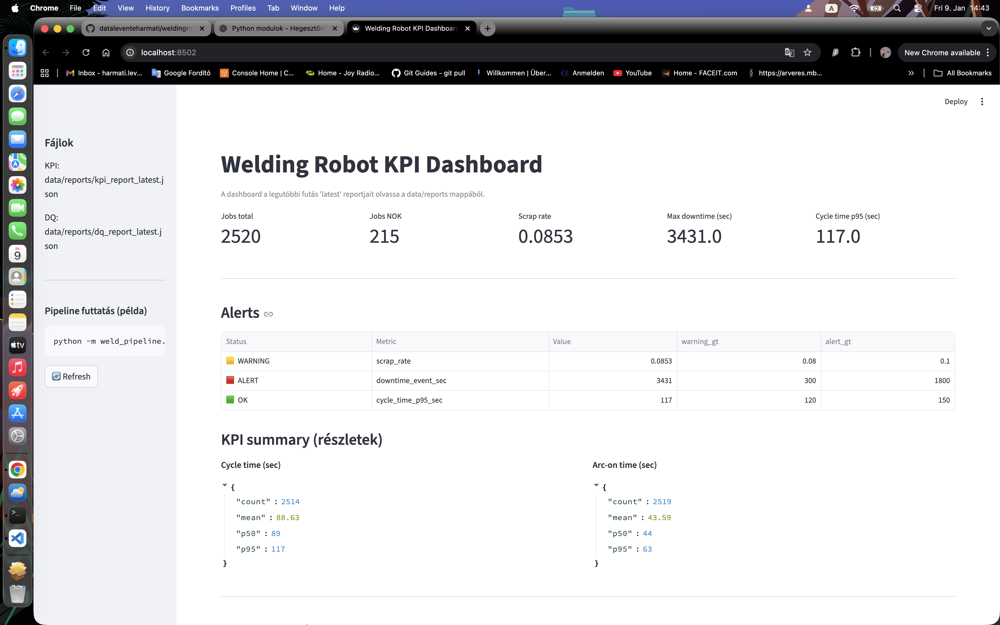

# WeldingRobot-DE-Pipeline (weld-pipeline)

Industrial-style Data Engineering pipeline for welding robot cell data:
synthetic → raw → staged → reports, with data-quality checks, KPI reporting,
and config-driven alerts.

This repository is designed as a portfolio project that mimics real
factory / industrial telemetry workflows.

--------------------------------------------------

WHAT IT DOES

1) Generate synthetic raw data
- robot_events_*.csv (robot event stream: START/END, ARC_ON/OFF, ERROR, RESET)
- quality_checks_*.csv (per-job OK / NOK quality result)

2) Transform + Data Quality report
- cleans and validates raw data
- writes staged CSV datasets
- produces dq_report_*.json and dq_report_latest.json

3) KPI report + Alerts (config-driven)
- computes production-style KPIs
- writes kpi_report_*.json and kpi_report_latest.json
- evaluates alerts (scrap rate, downtime, cycle time p95)

--------------------------------------------------

PROJECT STRUCTURE

config/
  thresholds.yaml

data/
  raw/
  staged/
  reports/

src/
  weld_pipeline/
    cli.py
    generate/
    transform/
    report/
    config/

tests/
dashboard.py
pyproject.toml

--------------------------------------------------

OUTPUTS

data/raw/
- generated raw CSV files

data/staged/
- cleaned / staged CSV files

data/reports/
- dq_report_latest.json
- kpi_report_latest.json
- timestamped historical reports

--------------------------------------------------

QUICKSTART

1) Create virtual environment and install dependencies

python -m venv .venv
source .venv/bin/activate
pip install -U pip
pip install -e .

--------------------------------------------------

2) Run end-to-end pipeline (recommended)

python -m weld_pipeline.cli run --days 7 --cells 3 --robots 2

This will:
- generate raw data in data/raw/
- write staged data to data/staged/
- write Data Quality report to data/reports/dq_report_latest.json
- write KPI report to data/reports/kpi_report_latest.json

--------------------------------------------------

CLI COMMANDS

Generate raw data only

python -m weld_pipeline.cli generate --days 7 --cells 3 --robots 2 --out-dir data/raw

Transform raw → staged + DQ

python -m weld_pipeline.cli transform \
  --events data/raw/robot_events_YYYYMMDD_HHMMSS.csv \
  --quality data/raw/quality_checks_YYYYMMDD_HHMMSS.csv

KPI report only (staged → KPI + alerts)

python -m weld_pipeline.cli report-kpi \
  --events data/staged/robot_events_staged_YYYYMMDD_HHMMSS.csv \
  --quality data/staged/quality_checks_staged_YYYYMMDD_HHMMSS.csv

--------------------------------------------------

ALERTS AND THRESHOLDS (CONFIG-DRIVEN)

Thresholds are defined in:

config/thresholds.yaml

Example:

scrap_rate:
  warning_gt: 0.08
  alert_gt: 0.10

downtime_event_sec:
  warning_gt: 300
  alert_gt: 1800

cycle_time_p95_sec:
  warning_gt: 120
  alert_gt: 150

Alerts are embedded directly in the KPI report with levels:
OK / WARNING / ALERT

--------------------------------------------------

REPORT CONTENTS

Data Quality report (dq_report_latest.json):
- input / output row counts
- missing timestamps
- duplicates removed
- ARC_ON / ARC_OFF pairing checks
- START / END cycle pairing checks

KPI report (kpi_report_latest.json):
- jobs_total, jobs_nok, scrap_rate
- cycle time statistics (mean / p50 / p95)
- arc-on time statistics (mean / p50 / p95)
- top error codes
- max_downtime_event_sec
- evaluated alerts

--------------------------------------------------

DASHBOARD

A Streamlit dashboard is included:

streamlit run dashboard.py

The dashboard reads the *_latest.json reports and displays:
- KPI cards
- alert table
- top error codes
- data quality report

--------------------------------------------------

WHY THIS IS INDUSTRIAL-STYLE

This project follows patterns commonly used in production Data Engineering:
- staged datasets
- immutable timestamped reports + idempotent "latest" outputs
- configuration-driven alert thresholds
- fully reproducible end-to-end pipeline
- test coverage and CI-ready structure

--------------------------------------------------

REQUIREMENTS

Python >= 3.10

Dependencies:
pandas
numpy
rich
pydantic
pyyaml
streamlit

--------------------------------------------------

LICENSE

MIT License
