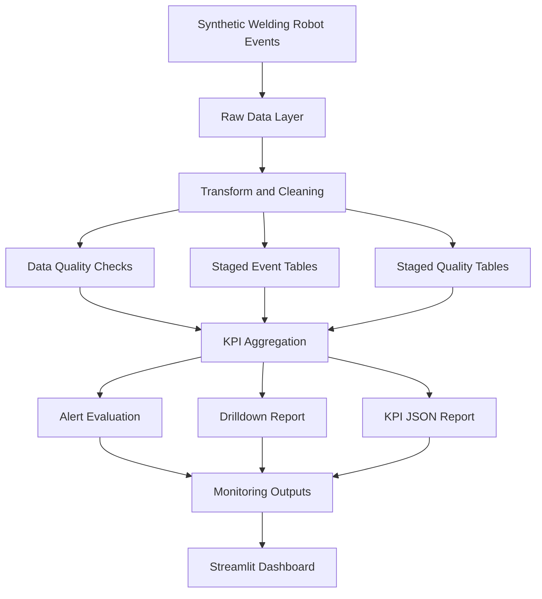

# Welding Robot Data Engineering Pipeline


Industrial-style **Data Engineering portfolio project** that simulates a manufacturing analytics pipeline for welding robots.

The project transforms synthetic robot event data into validated staged datasets, KPI reports, alert-ready metrics, and a monitoring dashboard.
It demonstrates practical Data Engineering skills in a production-like structure: configurable thresholds, automated reporting, testing, CI, and a reproducible CLI workflow.

---

## Demo


---

## Business Case

Manufacturing teams need fast visibility into robot performance, downtime, and scrap trends.

This project simulates a realistic scenario where raw machine events are transformed into analytics-ready outputs that can support:

- production monitoring
- anomaly detection
- quality trend analysis
- cell-level performance review
- portfolio demonstration of DE workflow design

---

## What this Project Demonstrates

- modular Python package structure (`src/`)
- CLI-based pipeline execution
- staged + reporting output layers
- configurable KPI alert thresholds (YAML)
- automated KPI + drilldown reporting
- Streamlit monitoring dashboard
- structured logging
- automated tests
- CI pipeline with GitHub Actions

---

## Architecture


```mermaid
flowchart TD
    A[Synthetic Welding Robot Events] --> B[Raw Data Layer]
    B --> C[Transform and Cleaning]
    C --> D[Data Quality Checks]
    C --> E[Staged Event Tables]
    C --> F[Staged Quality Tables]
    D --> G[KPI Aggregation]
    E --> G
    F --> G
    G --> H[Alert Evaluation]
    G --> I[Drilldown Report]
    G --> J[KPI JSON Report]
    H --> K[Monitoring Outputs]
    I --> K
    J --> K
    K --> L[Streamlit Dashboard]
```


---

## Repository Structure

```text
.
├── app/                    dashboard assets
├── assets/                 demo visuals
├── config/                 YAML threshold configs
├── data/
│   ├── raw/                raw / generated data
│   ├── staged/             validated intermediate outputs
│   └── reports/            KPI reports
├── logs/                   pipeline logs
├── scripts/                demo scripts
├── src/weld_pipeline/      main package
├── tests/                  pytest test suite
└── .github/workflows/      CI pipeline
```

---

## Tech Stack

- Python
- Pandas
- NumPy
- Streamlit
- PyYAML
- Pydantic
- Pytest
- GitHub Actions

---

## Quickstart

Create and activate a virtual environment:

```bash
python3 -m venv .venv
source .venv/bin/activate
python -m pip install --upgrade pip
pip install -e .[dev]
```

Run tests:

```bash
pytest -q
```

Check CLI commands:

```bash
python -m weld_pipeline.cli --help
```

Start dashboard:

```bash
streamlit run dashboard.py
```

---

## Example Workflow

Typical pipeline execution:

```bash
python -m weld_pipeline.cli generate
python -m weld_pipeline.cli transform
python -m weld_pipeline.cli report-kpi
python -m weld_pipeline.cli report-drilldown
python -m weld_pipeline.cli run
```

---

## Outputs

The pipeline generates:

- staged robot event tables
- staged quality check tables
- KPI JSON reports
- latest-report aliases for quick inspection
- monitoring dashboard outputs
- execution logs

---

## Data Quality and Alerting

The project includes configurable thresholds for operational metrics:

- scrap rate
- long downtime events
- cycle time p95

Thresholds are loaded from **YAML configuration** and evaluated into levels:

- OK
- WARNING
- ALERT

This demonstrates **configuration-driven monitoring inside a DE pipeline**.

---

## Why this is Portfolio-Relevant

This repository is positioned as a **junior → medior Data Engineering portfolio project**.

It demonstrates skills that hiring managers and freelance clients can quickly evaluate:

- pipeline structure
- reproducibility
- reporting outputs
- testability
- configuration management
- maintainability
- operational monitoring mindset

---

## Current Limitations

- synthetic data only
- local file storage layer
- lightweight CI
- no warehouse / orchestration layer

These are deliberate choices to keep the project portable and easy to review.

---

## Possible Future Improvements

- curated analytics layer
- coverage reporting in CI
- stricter schema validation
- Docker packaging
- richer dashboard storytelling

---

## License

MIT License
